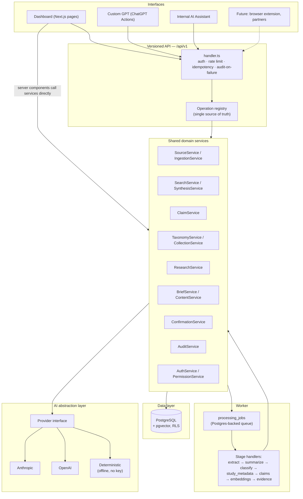
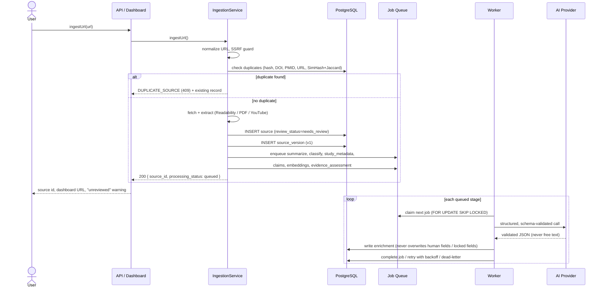
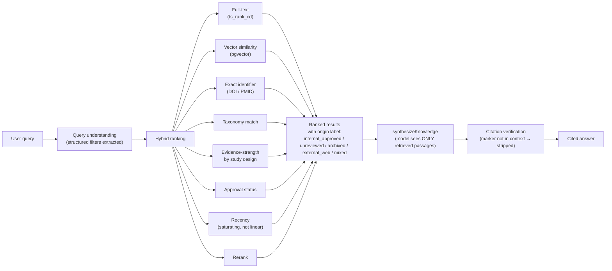
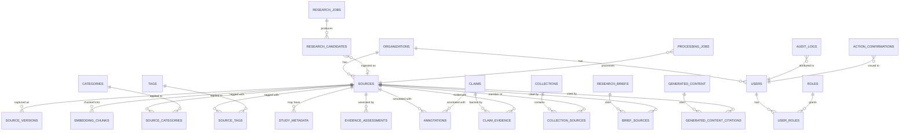

# Architecture

## System overview

**One domain model.** The dashboard, the API (and therefore the Custom GPT and any future integration), and the worker all call the same service functions in `src/services/*.ts`. There is no separate, weaker path for GPT-originated writes — permission checks, confirmation gating, and audit logging happen inside the service layer itself, so they apply identically regardless of which interface triggered the call.

## Ingestion and enrichment data flow

Every AI call in this flow is schema-validated (Zod) before anything is written — a response that doesn't match the expected shape is treated as a failure, not partially trusted. Retrieved and ingested content is always wrapped in an explicit untrusted-content boundary (`UNTRUSTED_CONTENT_PREAMBLE` in `src/ai/provider.ts`) so an instruction embedded in a scraped article cannot redirect the model's behavior.

## Search and synthesis data flow

## Entity relationships (core subset)

The full schema (32 tables) is in `db/migrations/0001`–`0005`. Every major table carries `organization_id`, `created_at`/`updated_at`, `created_by`/`updated_by`, and — where soft-deletion applies — `archived_at`/`archived_by`.

## Security layers (defense in depth)

1. **Application-level permission checks** (`requirePermission`) at both the service function and the API handler — a service refactor cannot silently open an endpoint, because the handler checks independently.
2. **Scope checks** for token-based callers (OAuth, API key) — the intersection of scope and permission is what's actually authorized; neither alone is sufficient.
3. **Row-level security** in Postgres itself — even a service-layer bug that forgets an `organization_id` filter cannot leak cross-organization rows, verified in `tests/integration/rls.test.ts` by attempting exactly that.
4. **SSRF guard** on every fetched URL (`src/extraction/fetch.ts`) — resolves and checks every hop's IP against private/link-local/metadata ranges before connecting.
5. **Prompt-injection containment** — untrusted content is always fenced and preceded by an explicit instruction boundary; the AI provider layer is the only place ingested text reaches a model.
6. **Server-issued confirmation** for high/critical-risk actions — a conversational "yes" from any interface is never itself authorization; the confirmation token is bound to the exact action, resource set, and payload hash, and can only be used once.
